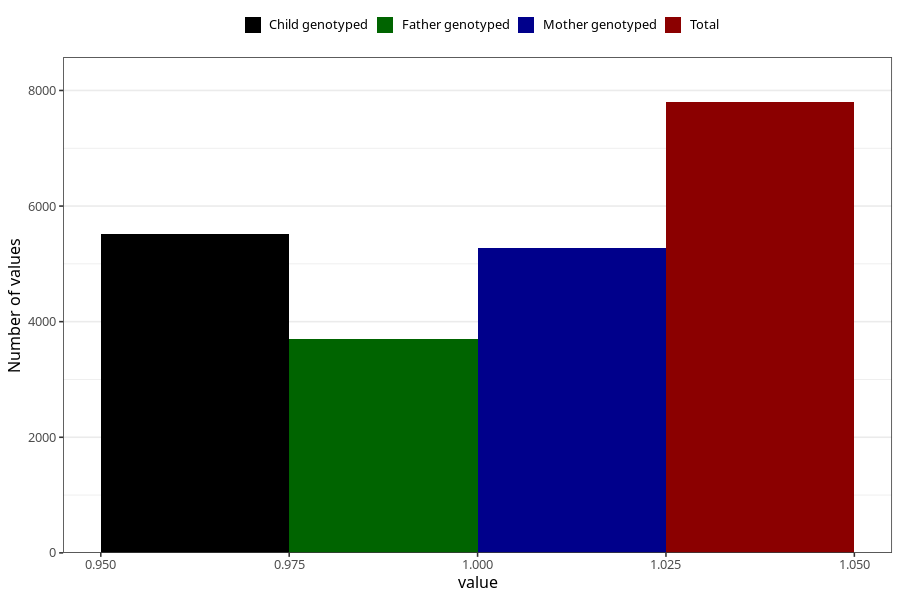

# vaginal_thrush_21w_24w
Variable mapping to questionnaire: q3, question CC402.
- Number of values:

| Value | Total | Child genotyped | Mother genotyped | Father genotyped |
| ----- | ----- | --------------- | ---------------- | ---------------- |
| Missing | 105826 | 77261 | 66499 | 46524 |
| Non-missing | 7797 | 6094 | 5270 | 3694 |
| 1 | 7797 | 6094 | 5270 | 3694 |

