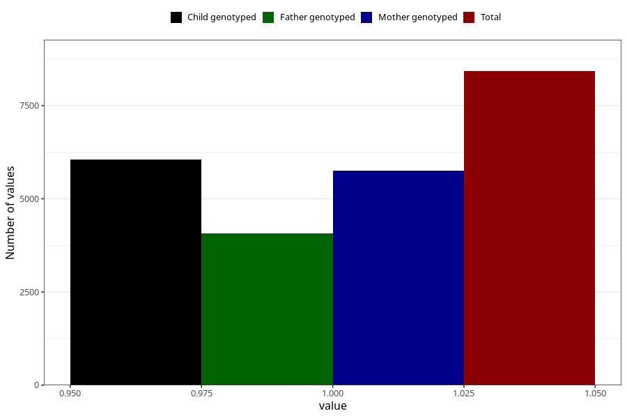

# vaginal_thrush_25w_28w
Variable mapping to questionnaire: q3, question CC403.
- Number of values:

| Value | Total | Child genotyped | Mother genotyped | Father genotyped |
| ----- | ----- | --------------- | ---------------- | ---------------- |
| Missing | 105199 | 76721 | 66010 | 46144 |
| Non-missing | 8424 | 6634 | 5759 | 4074 |
| 1 | 8424 | 6634 | 5759 | 4074 |

