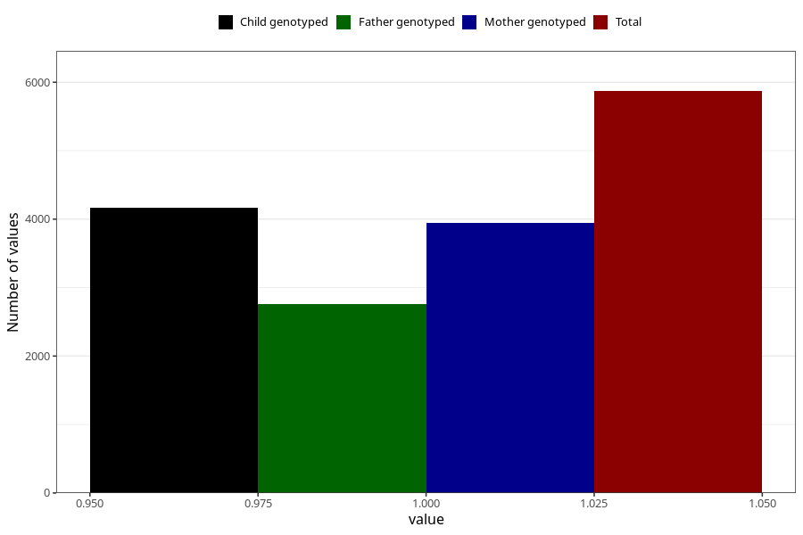

# vaginal_thrush_after_29w
Variable mapping to questionnaire: q3, question CC404.
- Number of values:

| Value | Total | Child genotyped | Mother genotyped | Father genotyped |
| ----- | ----- | --------------- | ---------------- | ---------------- |
| Missing | 107753 | 71263 | 67827 | 47459 |
| Non-missing | 5870 | 4168 | 3942 | 2759 |
| 1 | 5870 | 4168 | 3942 | 2759 |

