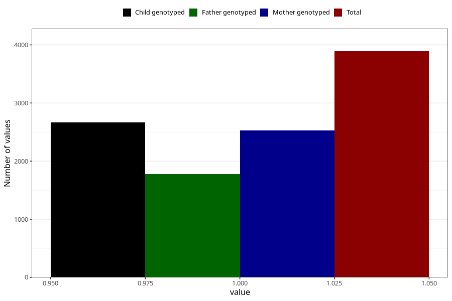

# vaginal_thrush_before_4w
Variable mapping to questionnaire: q1m, question AA236.
- Number of values:

| Value | Total | Child genotyped | Mother genotyped | Father genotyped |
| ----- | ----- | --------------- | ---------------- | ---------------- |
| Missing | 109733 | 72769 | 69241 | 48441 |
| Non-missing | 3890 | 2662 | 2528 | 1777 |
| 1 | 3890 | 2662 | 2528 | 1777 |

