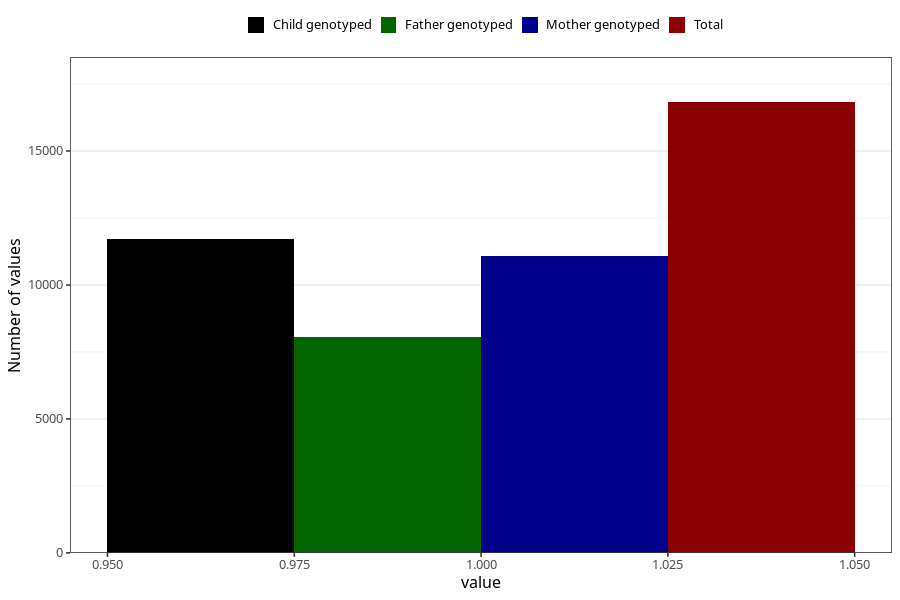

# vomiting_13w_15w
Variable mapping to questionnaire: q1m, question AA229.
- Number of values:

| Value | Total | Child genotyped | Mother genotyped | Father genotyped |
| ----- | ----- | --------------- | ---------------- | ---------------- |
| Missing | 96802 | 63720 | 60698 | 42164 |
| Non-missing | 16821 | 11711 | 11071 | 8054 |
| 1 | 16821 | 11711 | 11071 | 8054 |

