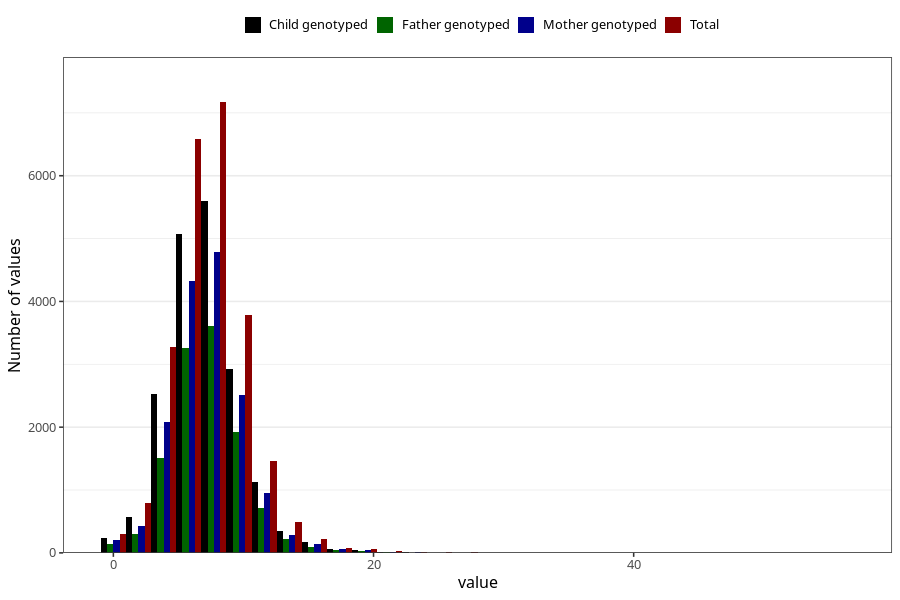

# vomiting_week_from_q2
Variable mapping to questionnaire: q2_cwd, question BB857.
- Number of values:

| Value | Total | Child genotyped | Mother genotyped | Father genotyped |
| ----- | ----- | --------------- | ---------------- | ---------------- |
| Missing | 89319 | 64615 | 55920 | 38343 |
| Non-missing | 24304 | 18740 | 15849 | 11875 |
| 25th percentile | 5 | 5 | 5 | 5 |
| 50th percentile | 7 | 7 | 7 | 7 |
| 75th percentile | 9 | 9 | 9 | 9 |

