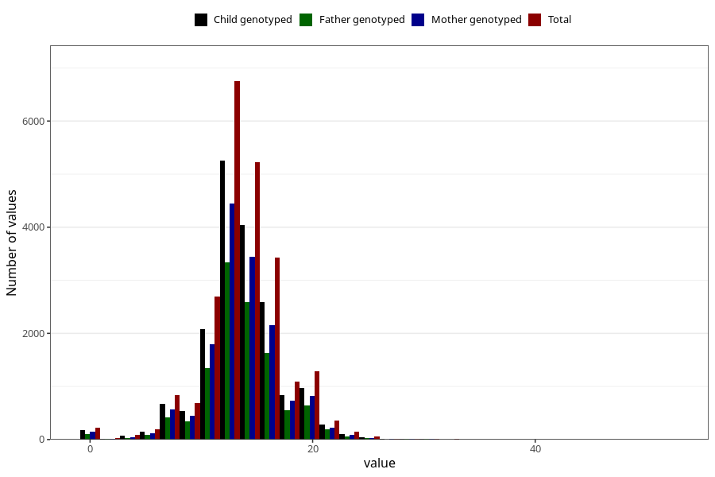

# vomiting_week_to_q2
Variable mapping to questionnaire: q2_cwd, question BB858.
- Number of values:

| Value | Total | Child genotyped | Mother genotyped | Father genotyped |
| ----- | ----- | --------------- | ---------------- | ---------------- |
| Missing | 90459 | 65488 | 56655 | 38864 |
| Non-missing | 23164 | 17867 | 15114 | 11354 |
| 25th percentile | 12 | 12 | 12 | 12 |
| 50th percentile | 14 | 13 | 13 | 14 |
| 75th percentile | 16 | 16 | 16 | 16 |

