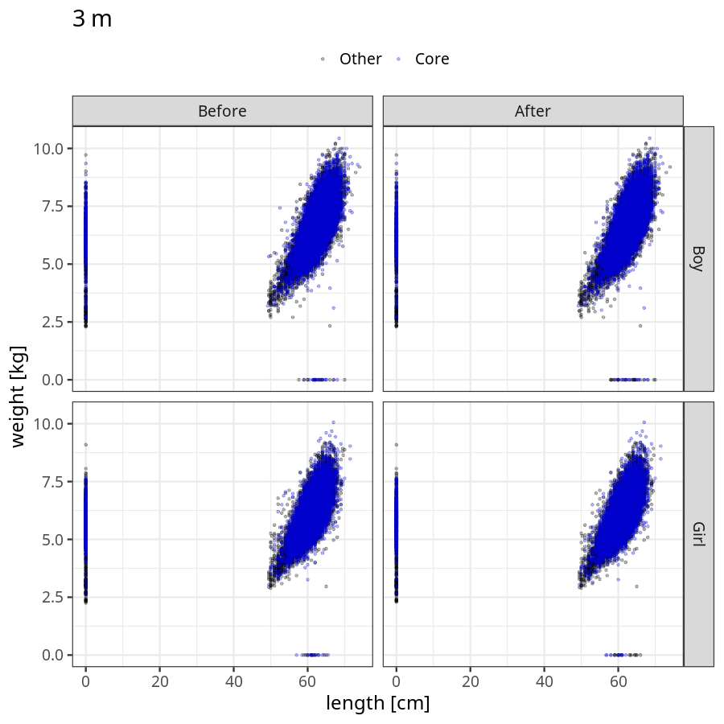
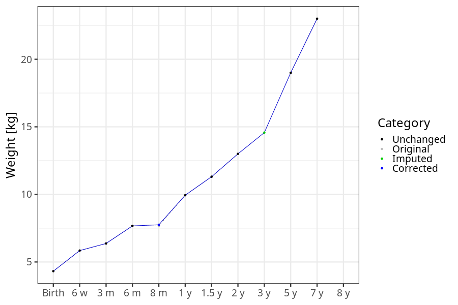
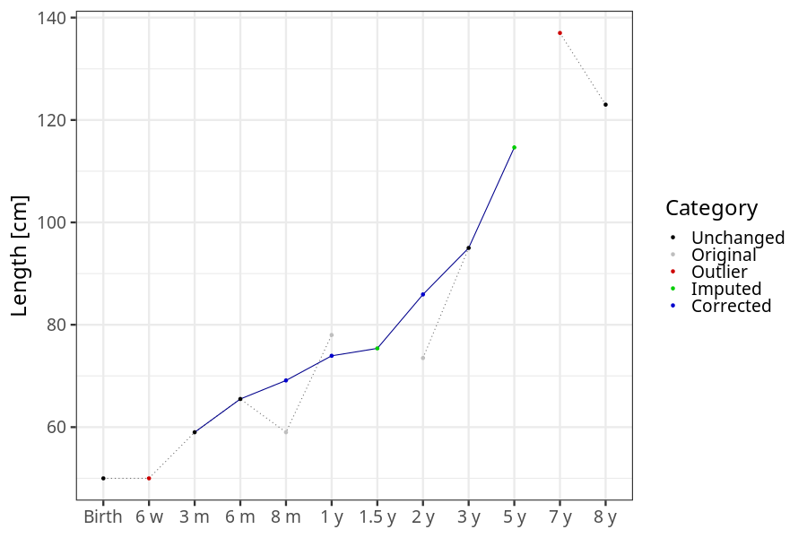
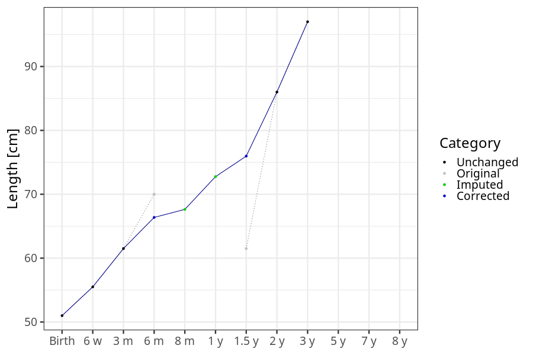

# Phenotypes
### Number of values

### Length vs weight

### Imputation
- Children with no data point altered: 68720
- Children with at least one data point altered: 44903
#### Random example: 46618
> imputed@length_16m imputed@length_2y imputed@weight_16m imputed@weight_2y

#### Random example: 42877
> imputed@length_16m imputed@length_2y imputed@weight_16m imputed@weight_2y

#### Random example: 12077
> imputed@length_16m imputed@length_2y imputed@weight_16m imputed@weight_2y

#### Random example: 814
> imputed@length_16m imputed@length_2y imputed@weight_16m imputed@weight_2y

#### Random example: 73894
> imputed@length_16m imputed@length_2y imputed@weight_16m imputed@weight_2y

#### Random example: 62260
> imputed@length_16m imputed@length_2y imputed@weight_16m imputed@weight_2y

#### Random example: 11529
> imputed@length_16m imputed@length_2y imputed@weight_16m imputed@weight_2y

#### Random example: 23040
> imputed@length_16m imputed@length_2y imputed@weight_16m imputed@weight_2y

#### Random example: 70135
> imputed@length_16m imputed@length_2y imputed@weight_16m imputed@weight_2y

#### Random example: 60606
> imputed@length_16m imputed@length_2y imputed@weight_16m imputed@weight_2y

#### Random example: 91268
> imputed@length_16m imputed@length_2y imputed@weight_16m imputed@weight_2y

#### Random example: 58232
> imputed@length_16m imputed@length_2y imputed@weight_16m imputed@weight_2y

#### Random example: 63409
> imputed@length_16m imputed@length_2y imputed@weight_16m imputed@weight_2y

#### Random example: 91129
> imputed@length_16m imputed@length_2y imputed@weight_16m imputed@weight_2y

#### Random example: 72968
> imputed@length_16m imputed@length_2y imputed@weight_16m imputed@weight_2y

#### Random example: 65449
> imputed@length_16m imputed@length_2y imputed@weight_16m imputed@weight_2y

#### Random example: 108713
> imputed@length_16m imputed@length_2y imputed@weight_16m imputed@weight_2y

#### Random example: 1196
> imputed@length_16m imputed@length_2y imputed@weight_16m imputed@weight_2y

#### Random example: 90093
> imputed@length_16m imputed@length_2y imputed@weight_16m imputed@weight_2y

#### Random example: 40624
> imputed@length_16m imputed@length_2y imputed@weight_16m imputed@weight_2y

#### Most extreme example (1): 62475
> 

#### Most extreme example (2): 60604
> 

#### Most extreme example (3): 80173
> imputed@length_16m imputed@length_2y imputed@weight_16m imputed@weight_2y

#### Most extreme example (4): 89538
> imputed@length_16m imputed@length_2y imputed@weight_16m imputed@weight_2y

#### Most extreme example (5): 53384
> 

#### Most extreme example (6): 37798
> imputed@length_8m imputed@length_1y imputed@length_16m imputed@weight_8m imputed@weight_1y imputed@weight_16m

#### Most extreme example (7): 94307
> outlier@length_2y imputed@length_2y

#### Most extreme example (8): 67820
> 

#### Most extreme example (9): 42012
> 

#### Most extreme example (10): 55305
> imputed@length_5y imputed@weight_5y

#### Most extreme example (11): 56182
> 

#### Most extreme example (12): 1606
> imputed@weight_6m imputed@weight_8m imputed@weight_16m

#### Most extreme example (13): 22575
> imputed@length_16m imputed@length_2y imputed@weight_16m imputed@weight_2y

#### Most extreme example (14): 12255
> 

#### Most extreme example (15): 80779
> 

#### Most extreme example (16): 69738
> outlier@weight_1y imputed@weight_1y imputed@weight_2y

#### Most extreme example (17): 105727
> 

#### Most extreme example (18): 11391
> 

#### Most extreme example (19): 69250
> imputed@length_16m imputed@length_2y imputed@weight_16m imputed@weight_2y

#### Most extreme example (20): 13551
> 

