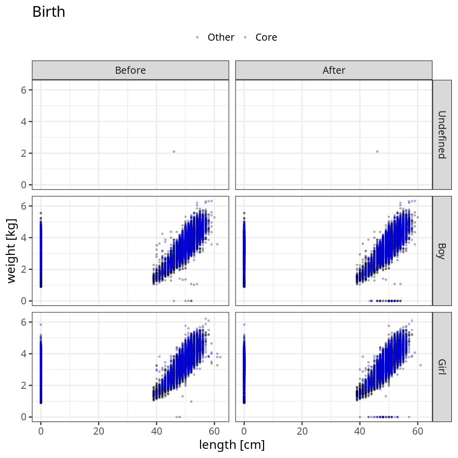
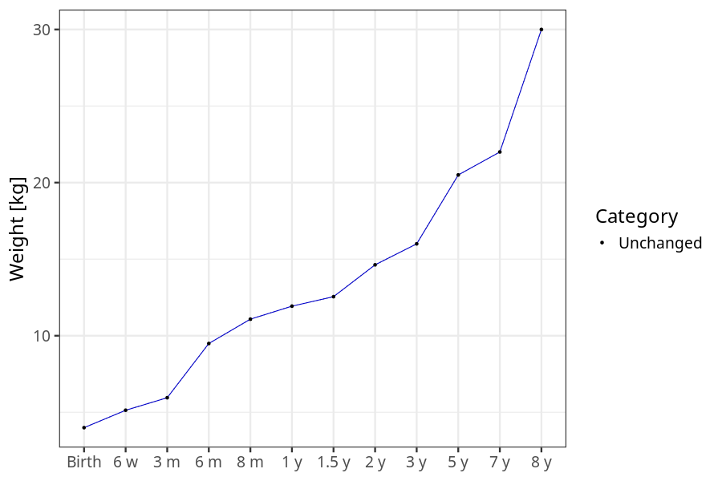
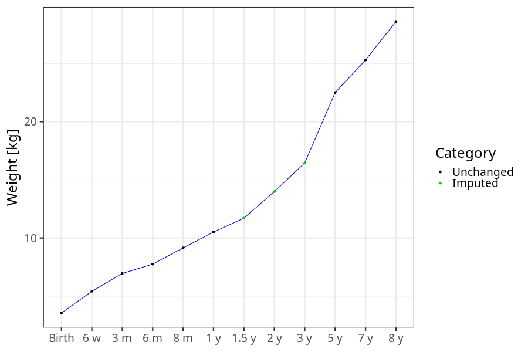
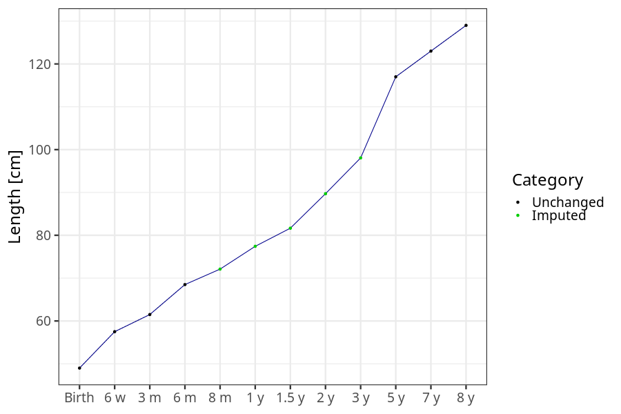
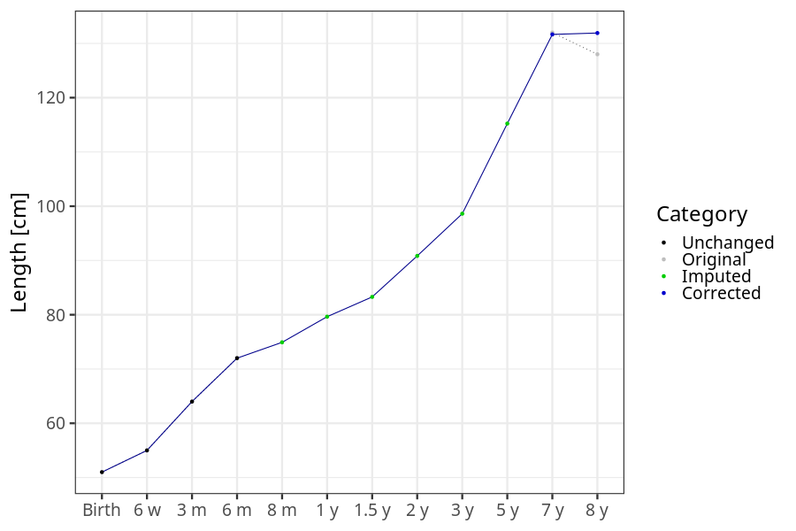
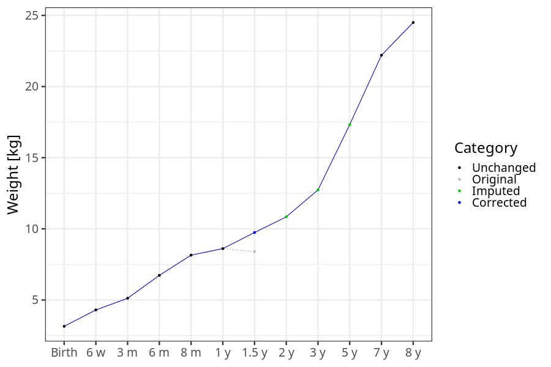
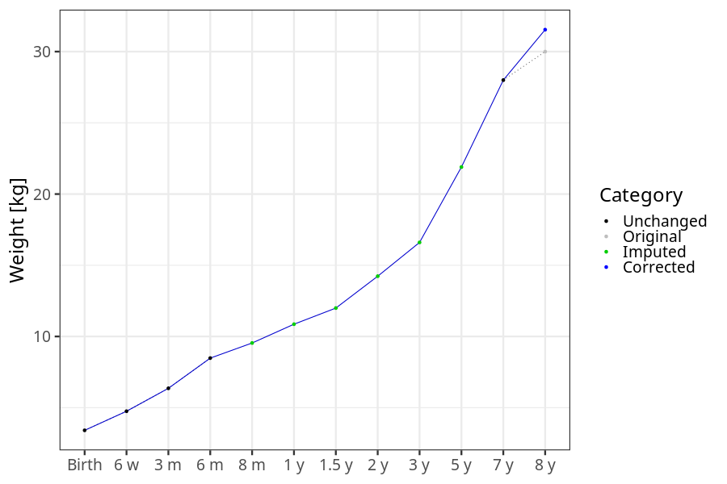

# Phenotypes
### Number of values

### Length vs weight

### Imputation
- Children with no data point altered: 68720
- Children with at least one data point altered: 44903
#### Random example: 96048
> imputed@length_16m imputed@length_2y imputed@weight_16m imputed@weight_2y

#### Random example: 20886
> imputed@length_16m imputed@length_2y imputed@weight_16m imputed@weight_2y

#### Random example: 108202
> imputed@length_16m imputed@length_2y imputed@weight_16m imputed@weight_2y

#### Random example: 70403
> imputed@length_16m imputed@length_2y imputed@weight_16m imputed@weight_2y

#### Random example: 4265
> imputed@length_16m imputed@length_2y imputed@weight_16m imputed@weight_2y

#### Random example: 74023
> imputed@length_16m imputed@length_2y imputed@weight_16m imputed@weight_2y

#### Random example: 39865
> imputed@length_16m imputed@length_2y imputed@weight_16m imputed@weight_2y

#### Random example: 100883
> imputed@length_16m imputed@length_2y imputed@weight_16m imputed@weight_2y

#### Random example: 85441
> imputed@length_16m imputed@length_2y imputed@weight_16m imputed@weight_2y

#### Random example: 107076
> imputed@length_16m imputed@length_2y imputed@weight_16m imputed@weight_2y

#### Random example: 101867
> imputed@length_16m imputed@length_2y imputed@weight_16m imputed@weight_2y

#### Random example: 53009
> imputed@length_16m imputed@length_2y imputed@weight_16m imputed@weight_2y

#### Random example: 49859
> imputed@length_16m imputed@length_2y imputed@weight_16m imputed@weight_2y

#### Random example: 87582
> imputed@length_16m imputed@length_2y imputed@weight_16m imputed@weight_2y

#### Random example: 36495
> imputed@length_16m imputed@length_2y imputed@weight_16m imputed@weight_2y

#### Random example: 28022
> imputed@length_16m imputed@length_2y imputed@weight_16m imputed@weight_2y

#### Random example: 47399
> imputed@length_16m imputed@length_2y imputed@weight_16m imputed@weight_2y

#### Random example: 60956
> imputed@length_16m imputed@length_2y imputed@weight_16m imputed@weight_2y

#### Random example: 53521
> imputed@length_16m imputed@length_2y imputed@weight_16m imputed@weight_2y

#### Random example: 75962
> imputed@length_16m imputed@length_2y imputed@weight_16m imputed@weight_2y

#### Most extreme example (1): 108682
> 

#### Most extreme example (2): 85947
> 

#### Most extreme example (3): 51142
> imputed@length_16m imputed@length_2y imputed@weight_16m imputed@weight_2y

#### Most extreme example (4): 102728
> imputed@length_16m imputed@length_2y imputed@weight_16m imputed@weight_2y

#### Most extreme example (5): 11270
> 

#### Most extreme example (6): 105986
> imputed@length_8m imputed@length_1y imputed@length_16m imputed@weight_8m imputed@weight_1y imputed@weight_16m

#### Most extreme example (7): 34271
> outlier@length_2y imputed@length_2y

#### Most extreme example (8): 85535
> 

#### Most extreme example (9): 68882
> 

#### Most extreme example (10): 17735
> imputed@length_5y imputed@weight_5y

#### Most extreme example (11): 78637
> 

#### Most extreme example (12): 63613
> imputed@weight_6m imputed@weight_8m imputed@weight_16m

#### Most extreme example (13): 4148
> imputed@length_16m imputed@length_2y imputed@weight_16m imputed@weight_2y

#### Most extreme example (14): 1535
> 

#### Most extreme example (15): 36068
> 

#### Most extreme example (16): 89331
> outlier@weight_1y imputed@weight_1y imputed@weight_2y

#### Most extreme example (17): 78380
> 

#### Most extreme example (18): 105329
> 

#### Most extreme example (19): 78372
> imputed@length_16m imputed@length_2y imputed@weight_16m imputed@weight_2y

#### Most extreme example (20): 9976
> 

