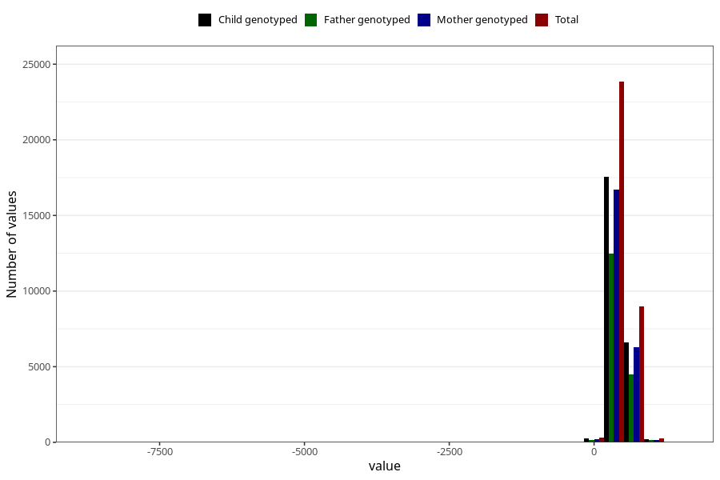

# age_16m
- Number of values:

| Value | Total | Child genotyped | Mother genotyped | Father genotyped |
| ----- | ----- | --------------- | ---------------- | ---------------- |
| Missing | 80224 | 50827 | 48299 | 32936 |
| Non-missing | 33399 | 24604 | 23470 | 17282 |
| 25th percentile | 460 | 460 | 460 | 459 |
| 50th percentile | 474 | 474 | 474 | 473 |
| 75th percentile | 526 | 526 | 526 | 523 |

