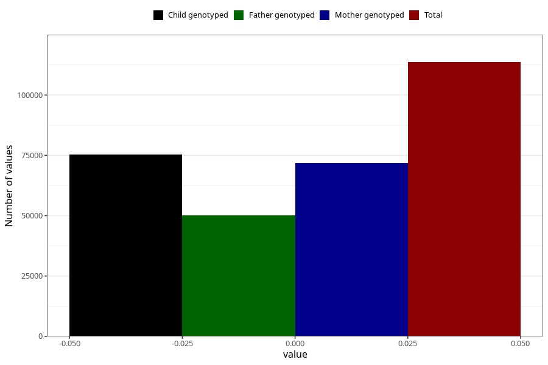

# age_birth
- Number of values:

| Value | Total | Child genotyped | Mother genotyped | Father genotyped |
| ----- | ----- | --------------- | ---------------- | ---------------- |
| Missing | 0 | 0 | 0 | 0 |
| Non-missing | 113623 | 75431 | 71769 | 50218 |
| 0 | 113623 | 75431 | 71769 | 50218 |

