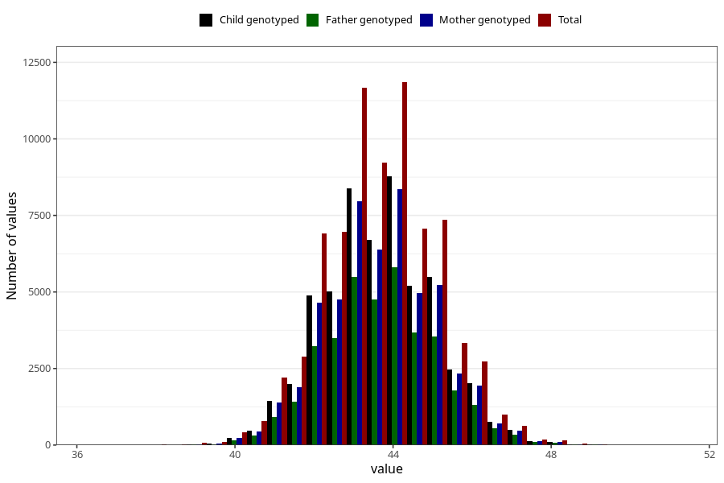

# hc_6m
Variable mapping to questionnaire: q4, question DD226.
- Number of values:

| Value | Total | Child genotyped | Mother genotyped | Father genotyped |
| ----- | ----- | --------------- | ---------------- | ---------------- |
| Missing | 37906 | 20702 | 19682 | 13198 |
| Non-missing | 75717 | 54729 | 52087 | 37020 |
| 25th percentile | 42.7 | 42.8 | 42.8 | 42.8 |
| 50th percentile | 43.6 | 43.7 | 43.7 | 43.7 |
| 75th percentile | 44.5 | 44.5 | 44.5 | 44.5 |

