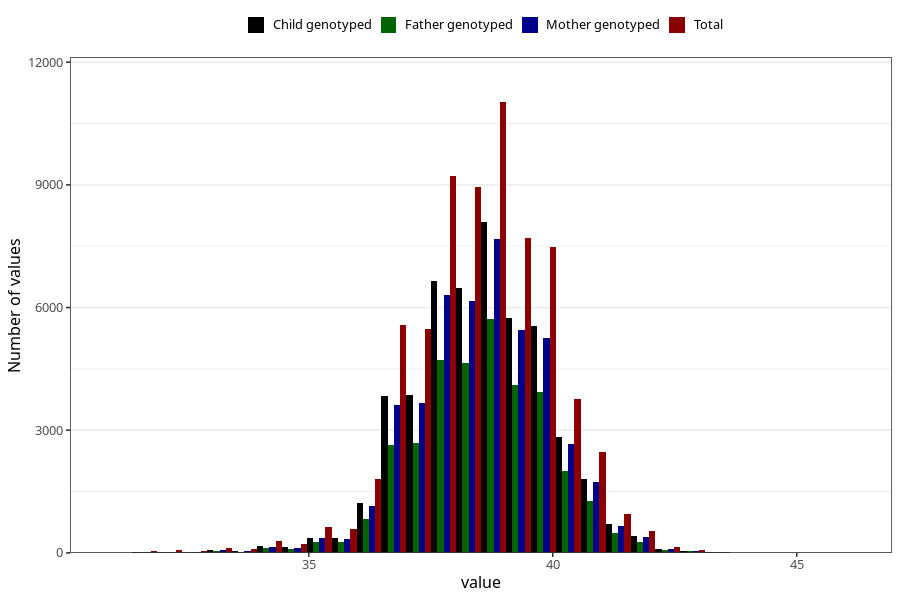

# hc_6w
Variable mapping to questionnaire: q4, question DD214.
- Number of values:

| Value | Total | Child genotyped | Mother genotyped | Father genotyped |
| ----- | ----- | --------------- | ---------------- | ---------------- |
| Missing | 46352 | 26875 | 25667 | 15917 |
| Non-missing | 67271 | 48556 | 46102 | 34301 |
| 25th percentile | 37.8 | 38 | 38 | 38 |
| 50th percentile | 38.6 | 38.7 | 38.7 | 38.7 |
| 75th percentile | 39.5 | 39.5 | 39.5 | 39.5 |

