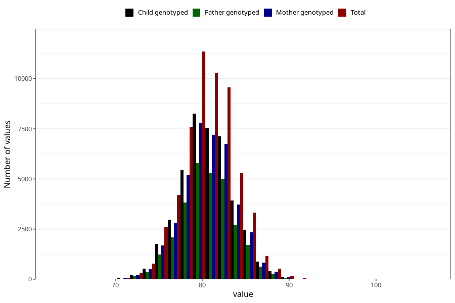

# length_16m
- Number of values:

| Value | Total | Child genotyped | Mother genotyped | Father genotyped |
| ----- | ----- | --------------- | ---------------- | ---------------- |
| Missing | 56243 | 33724 | 32134 | 21024 |
| Non-missing | 57380 | 41707 | 39635 | 29194 |
| 25th percentile | 78.5454895378259 | 78.7076291678206 | 78.6992977947136 | 78.7075506593331 |
| 50th percentile | 80.5026553281261 | 80.6483530113908 | 80.6568134990648 | 80.6303235290979 |
| 75th percentile | 82.5430523869948 | 82.6494999990381 | 82.6482976484977 | 82.6053164582963 |

