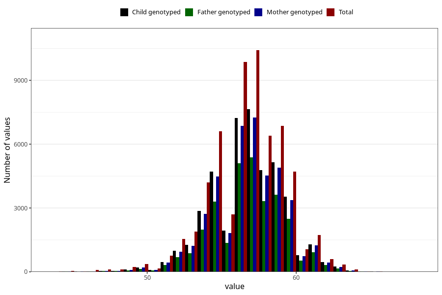

# length_6w
Variable mapping to questionnaire: q4, question DD213.
- Number of values:

| Value | Total | Child genotyped | Mother genotyped | Father genotyped |
| ----- | ----- | --------------- | ---------------- | ---------------- |
| Missing | 52668 | 31413 | 29918 | 19397 |
| Non-missing | 60955 | 44018 | 41851 | 30821 |
| 25th percentile | 55 | 55.5 | 55.5 | 55.5 |
| 50th percentile | 57 | 57 | 57 | 57 |
| 75th percentile | 58.5 | 58.5 | 58.5 | 58.5 |

