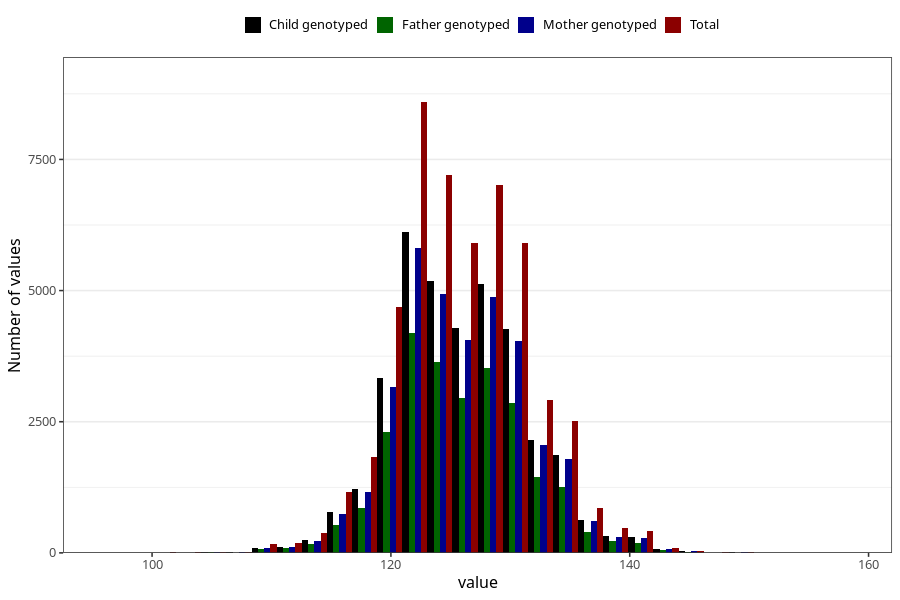

# length_7y
- Number of values:

| Value | Total | Child genotyped | Mother genotyped | Father genotyped |
| ----- | ----- | --------------- | ---------------- | ---------------- |
| Missing | 63181 | 39206 | 37338 | 25432 |
| Non-missing | 50442 | 36225 | 34431 | 24786 |
| 25th percentile | 122 | 122 | 122 | 122 |
| 50th percentile | 126 | 126 | 126 | 126 |
| 75th percentile | 130 | 130 | 130 | 130 |

