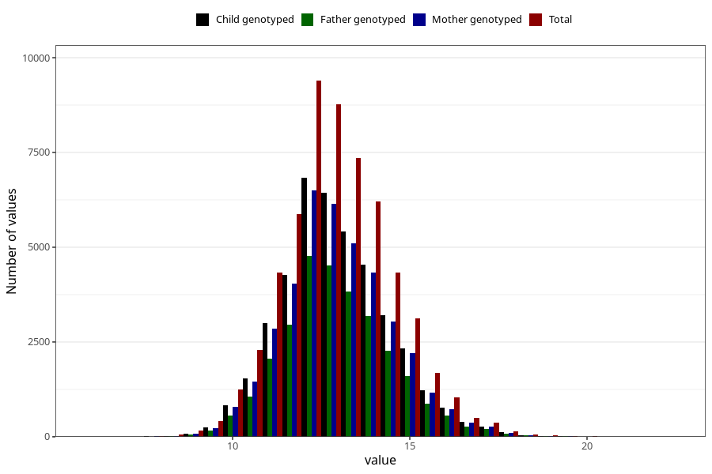

# weight_2y
Variable mapping to questionnaire: q6, question GG21.
- Number of values:

| Value | Total | Child genotyped | Mother genotyped | Father genotyped |
| ----- | ----- | --------------- | ---------------- | ---------------- |
| Missing | 56187 | 33799 | 32216 | 21104 |
| Non-missing | 57436 | 41632 | 39553 | 29114 |
| 25th percentile | 11.95 | 12 | 12 | 12 |
| 50th percentile | 12.9 | 12.9455232201947 | 12.9407749285236 | 12.9594801838297 |
| 75th percentile | 13.9606371889026 | 14 | 14 | 14 |

