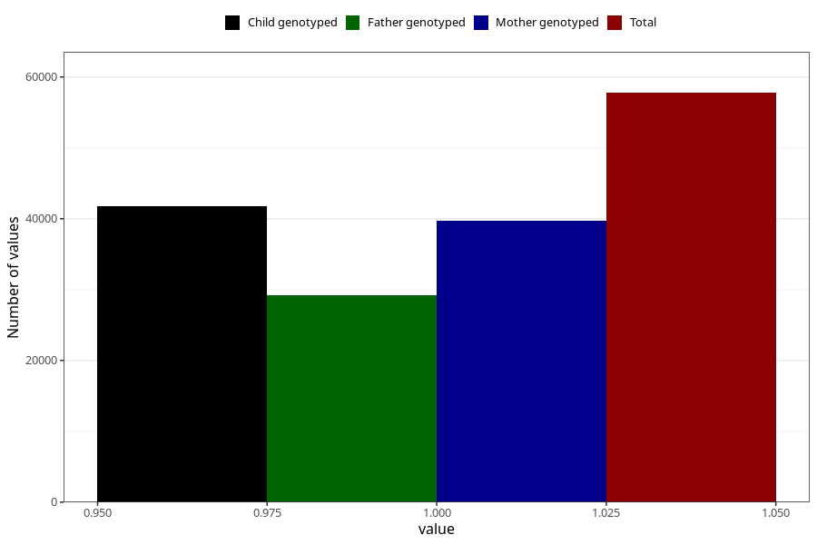

# cerebral_palsy_no_3y
Variable mapping to questionnaire: q6, question GG41.
- Number of values:

| Value | Total | Child genotyped | Mother genotyped | Father genotyped |
| ----- | ----- | --------------- | ---------------- | ---------------- |
| Missing | 55858 | 33605 | 32028 | 21066 |
| Non-missing | 57765 | 41826 | 39741 | 29152 |
| 1 | 57765 | 41826 | 39741 | 29152 |

