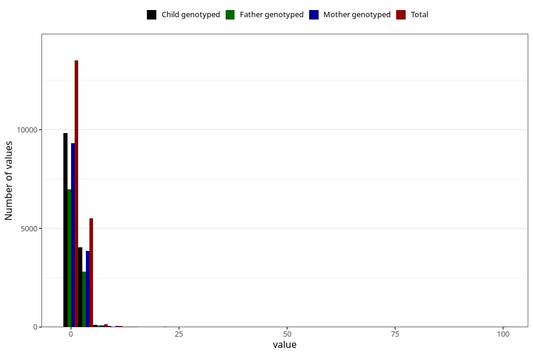

# conjunctivities_freq_6m
Variable mapping to questionnaire: q4, question DD292.
- Number of values:

| Value | Total | Child genotyped | Mother genotyped | Father genotyped |
| ----- | ----- | --------------- | ---------------- | ---------------- |
| Missing | 94330 | 61353 | 58406 | 40319 |
| Non-missing | 19293 | 14078 | 13363 | 9899 |
| 25th percentile | 1 | 1 | 1 | 1 |
| 50th percentile | 1 | 1 | 1 | 1 |
| 75th percentile | 2 | 2 | 2 | 2 |

