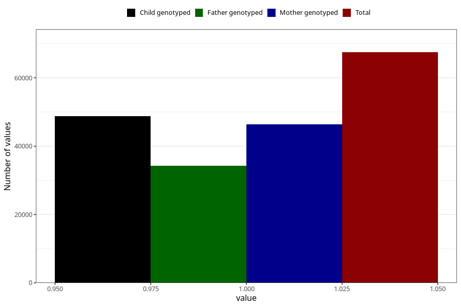

# delayed_motor_development_no_18m
Variable mapping to questionnaire: q5, question EE799.
- Number of values:

| Value | Total | Child genotyped | Mother genotyped | Father genotyped |
| ----- | ----- | --------------- | ---------------- | ---------------- |
| Missing | 46160 | 26596 | 25352 | 15967 |
| Non-missing | 67463 | 48835 | 46417 | 34251 |
| 1 | 67463 | 48835 | 46417 | 34251 |

