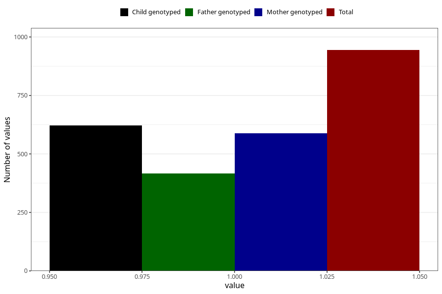

# delayed_motor_development_previous_3y
Variable mapping to questionnaire: q6, question GG39.
- Number of values:

| Value | Total | Child genotyped | Mother genotyped | Father genotyped |
| ----- | ----- | --------------- | ---------------- | ---------------- |
| Missing | 112679 | 74810 | 71180 | 49801 |
| Non-missing | 944 | 621 | 589 | 417 |
| 1 | 944 | 621 | 589 | 417 |

