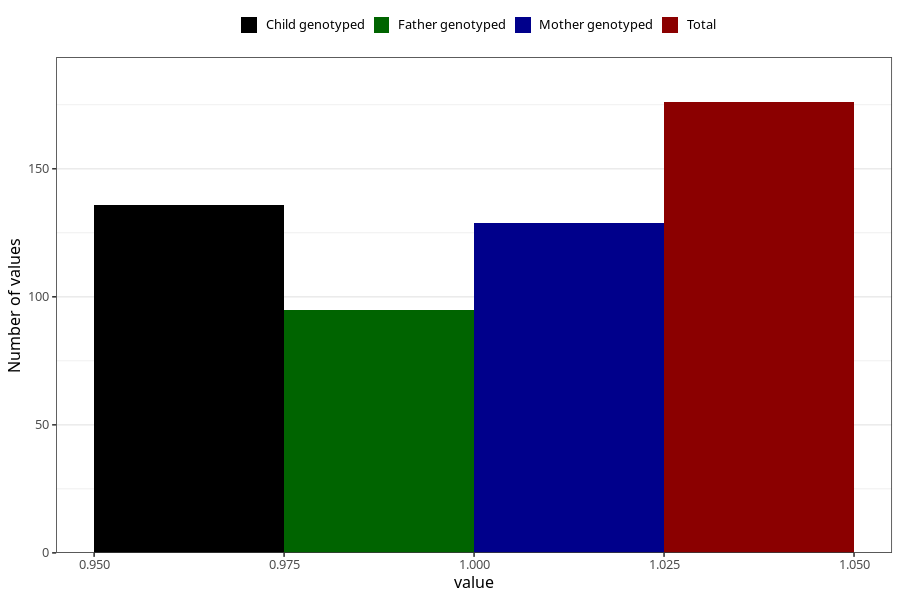

# diabetes_8y
Variable mapping to questionnaire: q9, question NN27.
- Number of values:

| Value | Total | Child genotyped | Mother genotyped | Father genotyped |
| ----- | ----- | --------------- | ---------------- | ---------------- |
| Missing | 113447 | 75295 | 71640 | 50123 |
| Non-missing | 176 | 136 | 129 | 95 |
| 1 | 176 | 136 | 129 | 95 |

