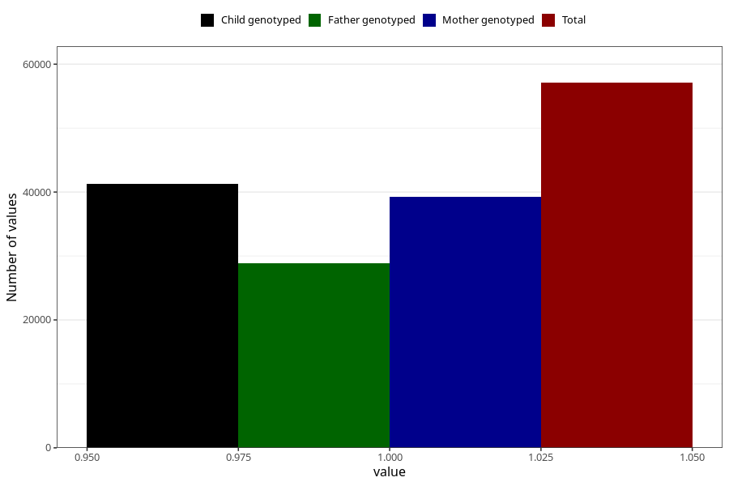

# diabetes_no_3y
Variable mapping to questionnaire: q6, question GG49.
- Number of values:

| Value | Total | Child genotyped | Mother genotyped | Father genotyped |
| ----- | ----- | --------------- | ---------------- | ---------------- |
| Missing | 56533 | 34127 | 32523 | 21405 |
| Non-missing | 57090 | 41304 | 39246 | 28813 |
| 1 | 57090 | 41304 | 39246 | 28813 |

