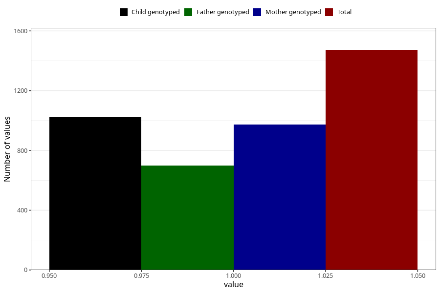

# food_allergy_intolerance_previously_18m
Variable mapping to questionnaire: q5, question EE837.
- Number of values:

| Value | Total | Child genotyped | Mother genotyped | Father genotyped |
| ----- | ----- | --------------- | ---------------- | ---------------- |
| Missing | 112150 | 74407 | 70794 | 49520 |
| Non-missing | 1473 | 1024 | 975 | 698 |
| 1 | 1473 | 1024 | 975 | 698 |

