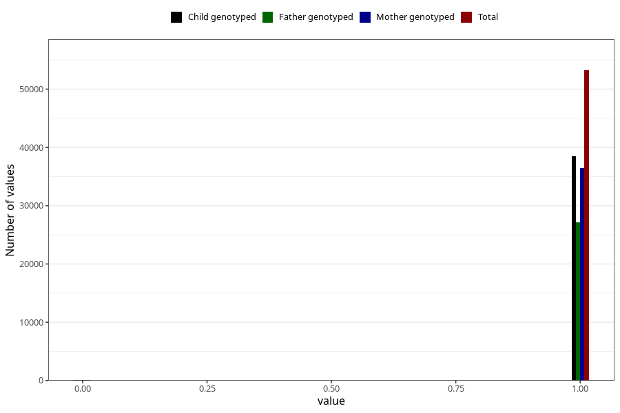

# frequent_stomach_pain_no_3y
Variable mapping to questionnaire: q6, question GG570.
- Number of values:

| Value | Total | Child genotyped | Mother genotyped | Father genotyped |
| ----- | ----- | --------------- | ---------------- | ---------------- |
| Missing | 60262 | 36873 | 35164 | 23040 |
| Non-missing | 53361 | 38558 | 36605 | 27178 |
| 0 | 143 | 103 | 96 | 71 |
| 1 | 53218 | 38455 | 36509 | 27107 |

