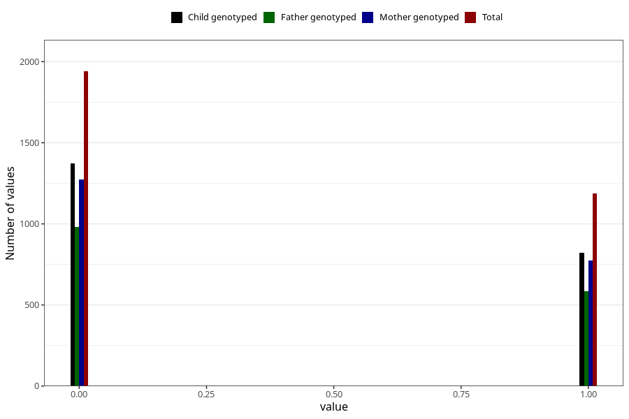

# frequent_stomach_pain_previous_3y
Variable mapping to questionnaire: q6, question GG572.
- Number of values:

| Value | Total | Child genotyped | Mother genotyped | Father genotyped |
| ----- | ----- | --------------- | ---------------- | ---------------- |
| Missing | 110495 | 73239 | 69721 | 48654 |
| Non-missing | 3128 | 2192 | 2048 | 1564 |
| 0 | 1940 | 1372 | 1273 | 981 |
| 1 | 1188 | 820 | 775 | 583 |

