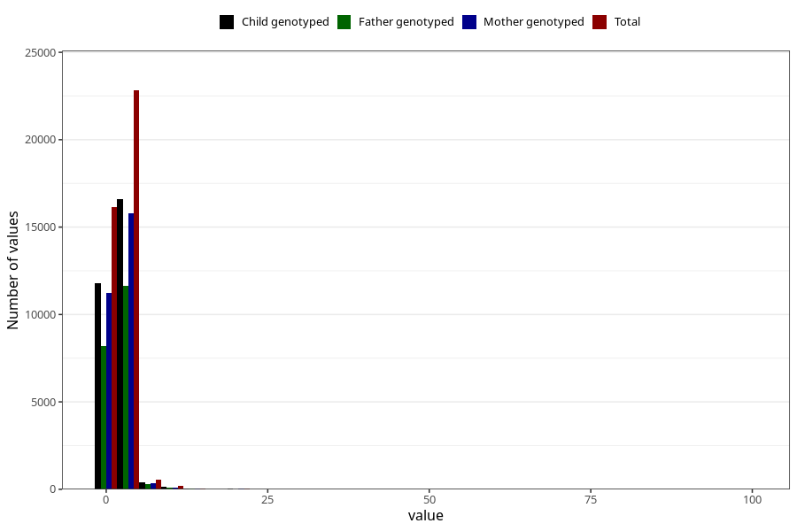

# gastric_flu_diarrhea_freq_3y
Variable mapping to questionnaire: q6, question GG150.
- Number of values:

| Value | Total | Child genotyped | Mother genotyped | Father genotyped |
| ----- | ----- | --------------- | ---------------- | ---------------- |
| Missing | 73837 | 46438 | 44219 | 29998 |
| Non-missing | 39786 | 28993 | 27550 | 20220 |
| 25th percentile | 1 | 1 | 1 | 1 |
| 50th percentile | 2 | 2 | 2 | 2 |
| 75th percentile | 2 | 2 | 2 | 2 |

