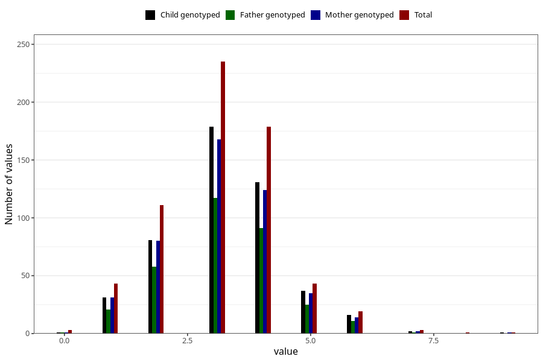

# hip_dysplasia_treatment_duration_6m
Variable mapping to questionnaire: q4, question DD262.
- Number of values:

| Value | Total | Child genotyped | Mother genotyped | Father genotyped |
| ----- | ----- | --------------- | ---------------- | ---------------- |
| Missing | 112985 | 74952 | 71313 | 49893 |
| Non-missing | 638 | 479 | 456 | 325 |
| 0 | 3 | 1 | 1 | 1 |
| 1 | 43 | 31 | 31 | 21 |
| 2 | 111 | 81 | 80 | 58 |
| 3 | 235 | 179 | 168 | 117 |
| 4 | 179 | 131 | 124 | 91 |
| 5 | 43 | 37 | 35 | 25 |
| 6 | 19 | 16 | 14 | 11 |
| 7 | 3 | 2 | 2 | 1 |
| 8 | 1 | 0 | 0 | 0 |
| 9 | 1 | 1 | 1 | 0 |

