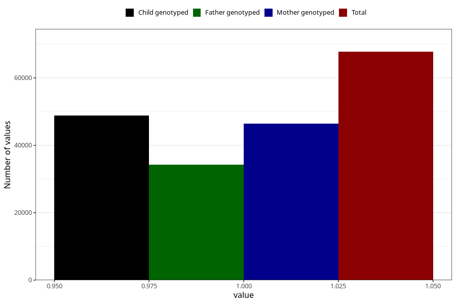

# hives_no_18m
Variable mapping to questionnaire: q5, question EE831.
- Number of values:

| Value | Total | Child genotyped | Mother genotyped | Father genotyped |
| ----- | ----- | --------------- | ---------------- | ---------------- |
| Missing | 45865 | 26629 | 25404 | 15994 |
| Non-missing | 67758 | 48802 | 46365 | 34224 |
| 1 | 67758 | 48802 | 46365 | 34224 |

