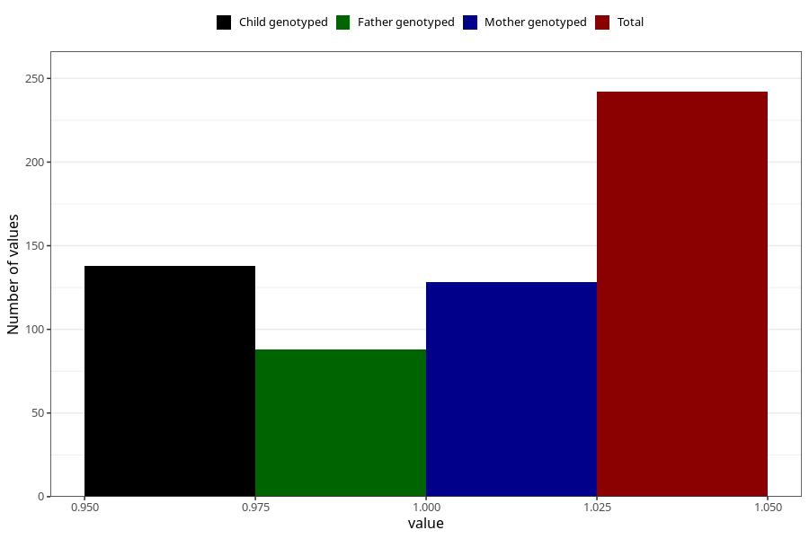

# hyperactivity_yes_3y
Variable mapping to questionnaire: q6, question GG106.
- Number of values:

| Value | Total | Child genotyped | Mother genotyped | Father genotyped |
| ----- | ----- | --------------- | ---------------- | ---------------- |
| Missing | 113381 | 75293 | 71641 | 50130 |
| Non-missing | 242 | 138 | 128 | 88 |
| 1 | 242 | 138 | 128 | 88 |

