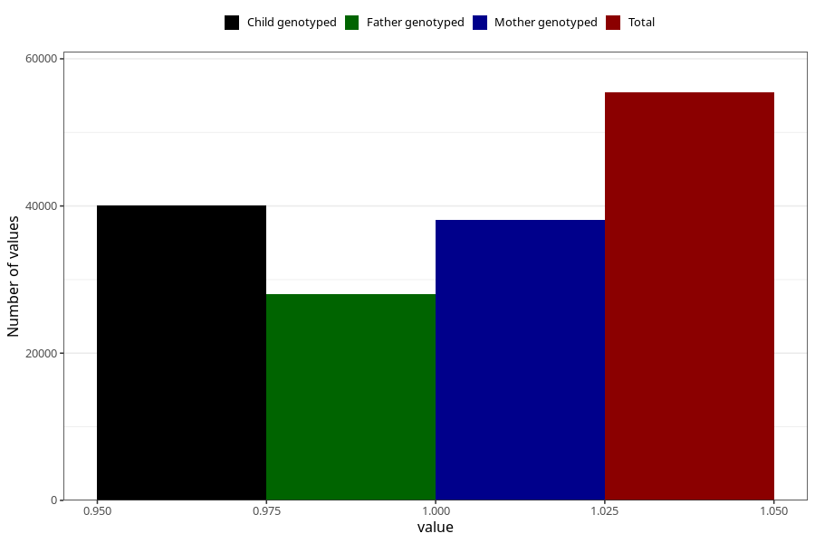

# impaired_hearing_no_3y
Variable mapping to questionnaire: q6, question GG29.
- Number of values:

| Value | Total | Child genotyped | Mother genotyped | Father genotyped |
| ----- | ----- | --------------- | ---------------- | ---------------- |
| Missing | 58203 | 35314 | 33639 | 22221 |
| Non-missing | 55420 | 40117 | 38130 | 27997 |
| 1 | 55420 | 40117 | 38130 | 27997 |

