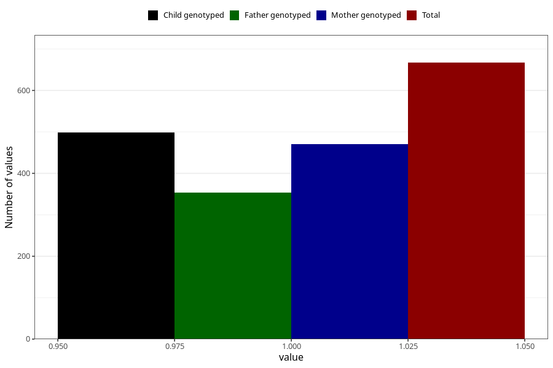

# impaired_hearing_previously_18m
Variable mapping to questionnaire: q5, question EE793.
- Number of values:

| Value | Total | Child genotyped | Mother genotyped | Father genotyped |
| ----- | ----- | --------------- | ---------------- | ---------------- |
| Missing | 112956 | 74932 | 71298 | 49864 |
| Non-missing | 667 | 499 | 471 | 354 |
| 1 | 667 | 499 | 471 | 354 |

