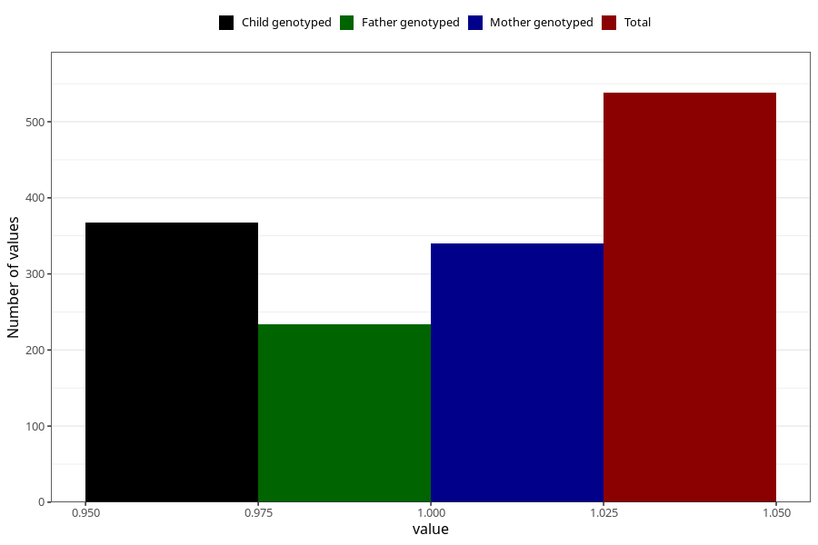

# impaired_hearing_yes_18m
Variable mapping to questionnaire: q5, question EE792.
- Number of values:

| Value | Total | Child genotyped | Mother genotyped | Father genotyped |
| ----- | ----- | --------------- | ---------------- | ---------------- |
| Missing | 113085 | 75063 | 71429 | 49984 |
| Non-missing | 538 | 368 | 340 | 234 |
| 1 | 538 | 368 | 340 | 234 |

