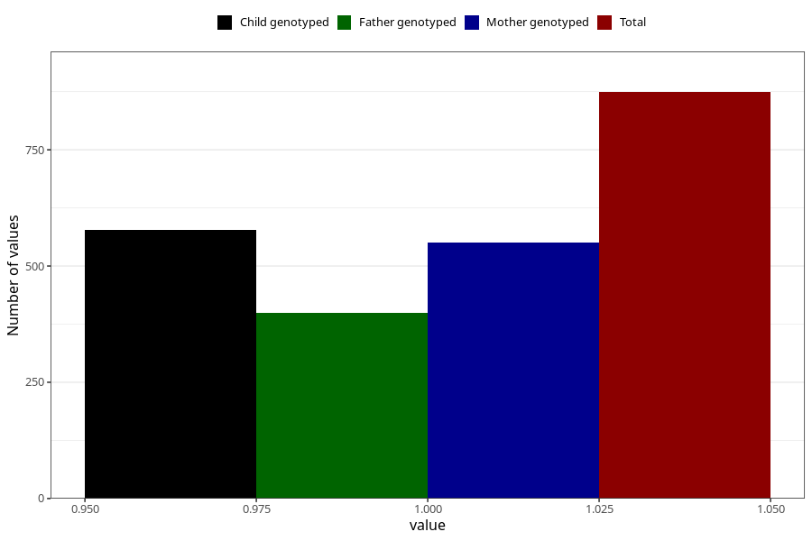

# impaired_vision_yes_3y
Variable mapping to questionnaire: q6, question GG34.
- Number of values:

| Value | Total | Child genotyped | Mother genotyped | Father genotyped |
| ----- | ----- | --------------- | ---------------- | ---------------- |
| Missing | 112749 | 74854 | 71218 | 49818 |
| Non-missing | 874 | 577 | 551 | 400 |
| 1 | 874 | 577 | 551 | 400 |

