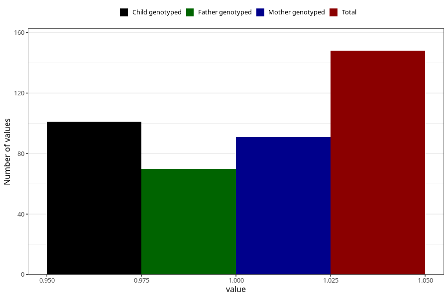

# joint_problems_previous_3y
Variable mapping to questionnaire: q6, question GG47.
- Number of values:

| Value | Total | Child genotyped | Mother genotyped | Father genotyped |
| ----- | ----- | --------------- | ---------------- | ---------------- |
| Missing | 113475 | 75330 | 71678 | 50148 |
| Non-missing | 148 | 101 | 91 | 70 |
| 1 | 148 | 101 | 91 | 70 |

