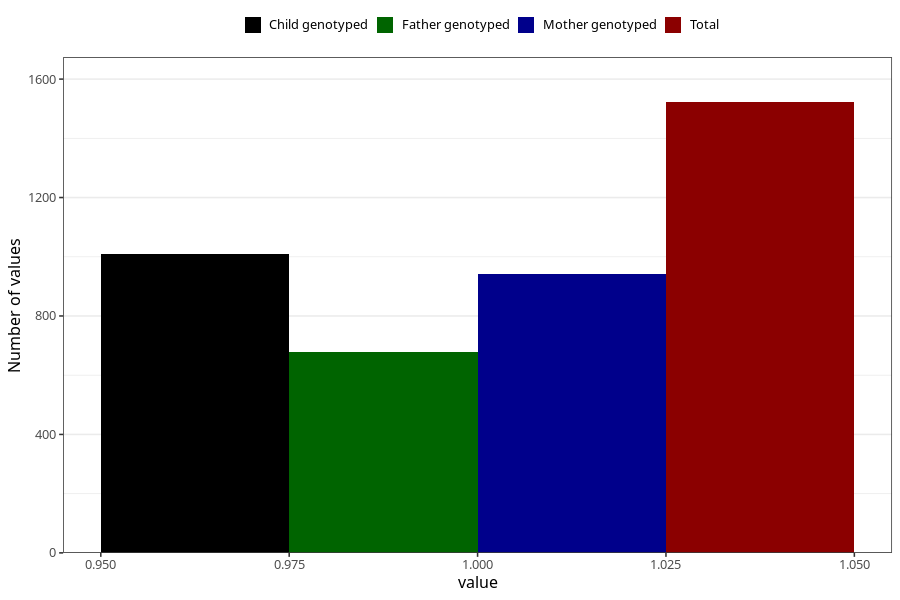

# late_or_abnormal_speech_development_yes_3y
Variable mapping to questionnaire: q6, question GG94.
- Number of values:

| Value | Total | Child genotyped | Mother genotyped | Father genotyped |
| ----- | ----- | --------------- | ---------------- | ---------------- |
| Missing | 112101 | 74422 | 70827 | 49540 |
| Non-missing | 1522 | 1009 | 942 | 678 |
| 1 | 1522 | 1009 | 942 | 678 |

