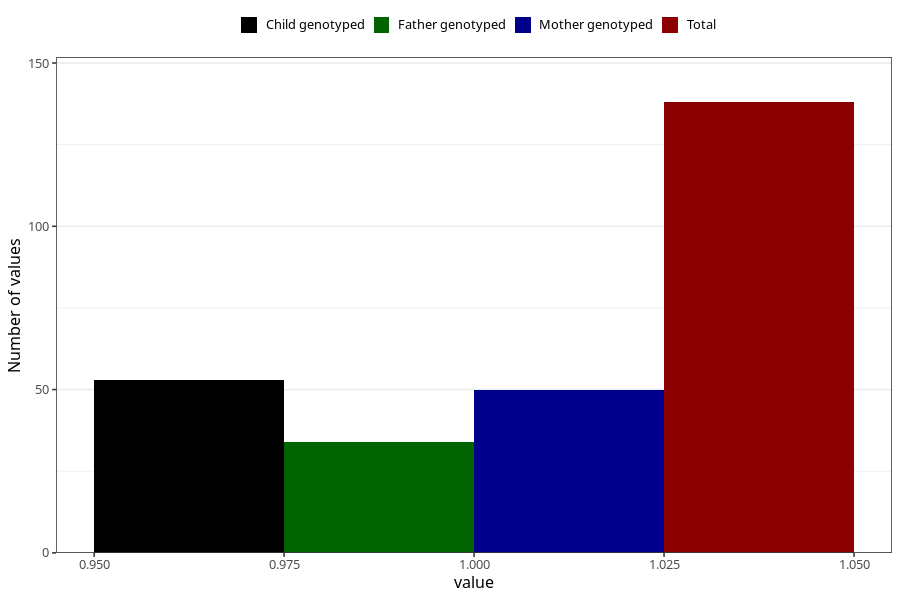

# mental_retardation_7y
Variable mapping to questionnaire: q8, question JJ435.
- Number of values:

| Value | Total | Child genotyped | Mother genotyped | Father genotyped |
| ----- | ----- | --------------- | ---------------- | ---------------- |
| Missing | 113485 | 75378 | 71719 | 50184 |
| Non-missing | 138 | 53 | 50 | 34 |
| 1 | 138 | 53 | 50 | 34 |

