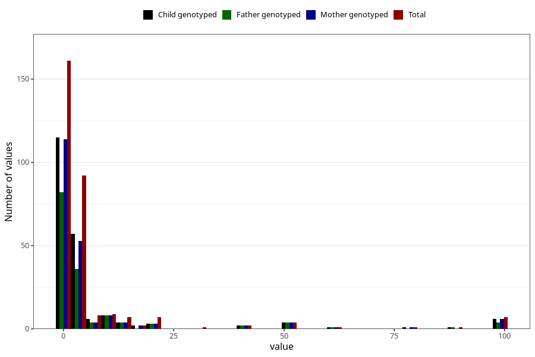

# other_convulsions_without_any_fever_freq_3y
Variable mapping to questionnaire: q6, question GG162.
- Number of values:

| Value | Total | Child genotyped | Mother genotyped | Father genotyped |
| ----- | ----- | --------------- | ---------------- | ---------------- |
| Missing | 113320 | 75221 | 71567 | 50069 |
| Non-missing | 303 | 210 | 202 | 149 |
| 25th percentile | 1 | 1 | 1 | 1 |
| 50th percentile | 1 | 1 | 1 | 1 |
| 75th percentile | 4 | 4 | 4 | 5 |

