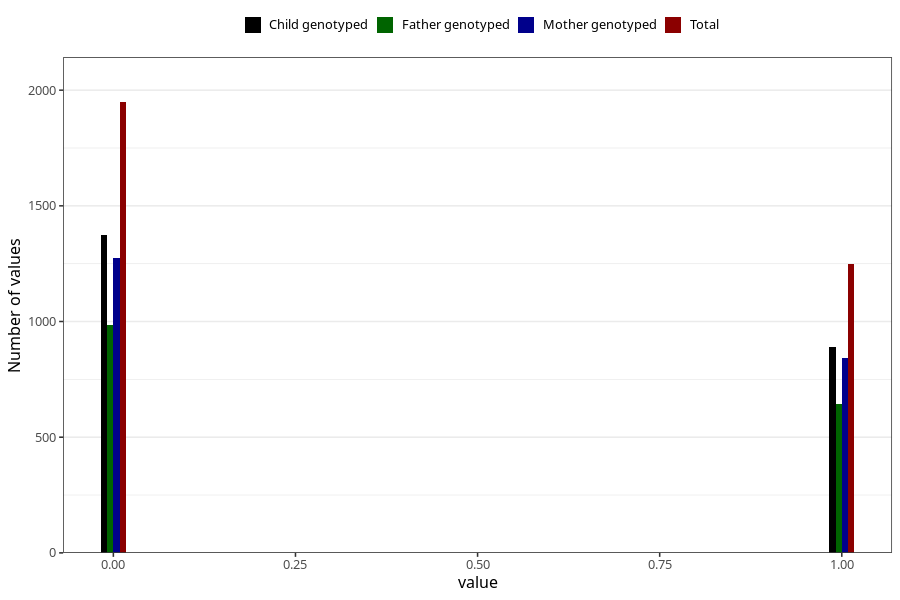

# other_gastrointestinal_problems_2_yes_3y
Variable mapping to questionnaire: q6, question GG575.
- Number of values:

| Value | Total | Child genotyped | Mother genotyped | Father genotyped |
| ----- | ----- | --------------- | ---------------- | ---------------- |
| Missing | 110426 | 73165 | 69649 | 48588 |
| Non-missing | 3197 | 2266 | 2120 | 1630 |
| 0 | 1948 | 1376 | 1276 | 986 |
| 1 | 1249 | 890 | 844 | 644 |

