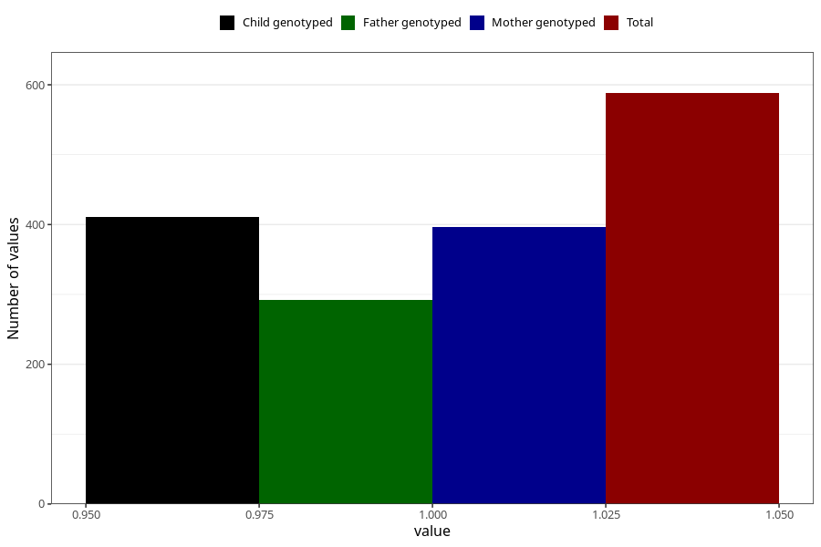

# other_malformations_previously_18m
Variable mapping to questionnaire: q5, question EE853.
- Number of values:

| Value | Total | Child genotyped | Mother genotyped | Father genotyped |
| ----- | ----- | --------------- | ---------------- | ---------------- |
| Missing | 113035 | 75020 | 71373 | 49926 |
| Non-missing | 588 | 411 | 396 | 292 |
| 1 | 588 | 411 | 396 | 292 |

