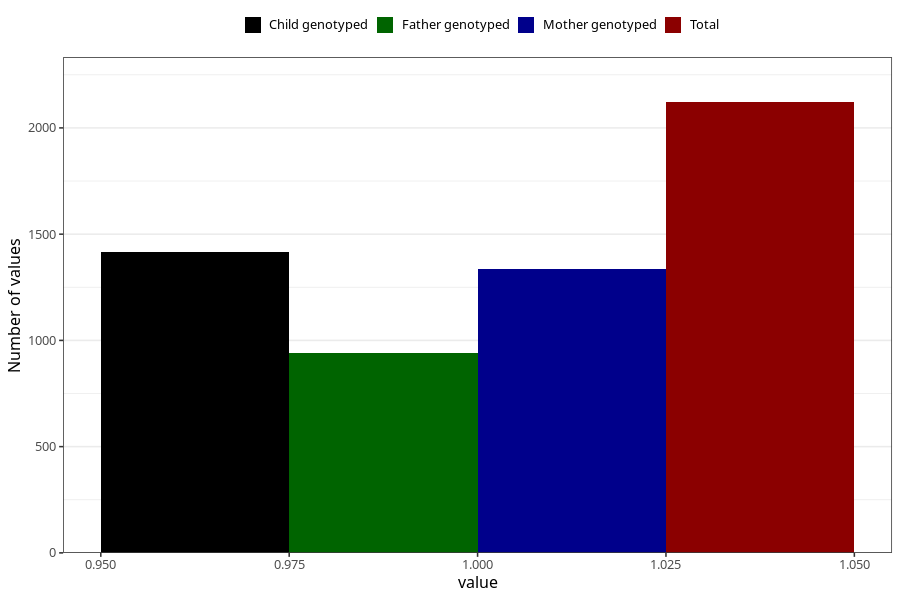

# sleep_problems_yes_18m
Variable mapping to questionnaire: q5, question EE844.
- Number of values:

| Value | Total | Child genotyped | Mother genotyped | Father genotyped |
| ----- | ----- | --------------- | ---------------- | ---------------- |
| Missing | 111502 | 74015 | 70431 | 49276 |
| Non-missing | 2121 | 1416 | 1338 | 942 |
| 1 | 2121 | 1416 | 1338 | 942 |

