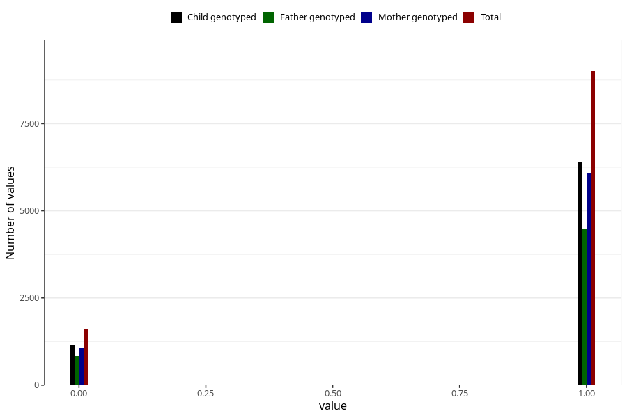

# specialist_diagnosis_1_3y
Variable mapping to questionnaire: q6, question GG118.
- Number of values:

| Value | Total | Child genotyped | Mother genotyped | Father genotyped |
| ----- | ----- | --------------- | ---------------- | ---------------- |
| Missing | 102998 | 67851 | 64610 | 44880 |
| Non-missing | 10625 | 7580 | 7159 | 5338 |
| 0 | 1622 | 1166 | 1079 | 846 |
| 1 | 9003 | 6414 | 6080 | 4492 |

