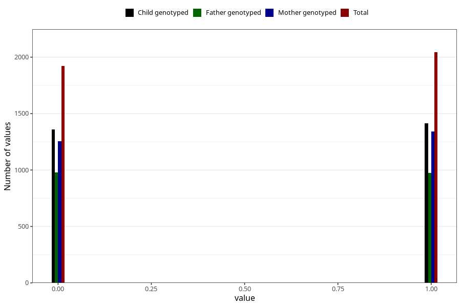

# specialist_diagnosis_2_3y
Variable mapping to questionnaire: q6, question GG120.
- Number of values:

| Value | Total | Child genotyped | Mother genotyped | Father genotyped |
| ----- | ----- | --------------- | ---------------- | ---------------- |
| Missing | 109658 | 72660 | 69173 | 48267 |
| Non-missing | 3965 | 2771 | 2596 | 1951 |
| 0 | 1922 | 1358 | 1257 | 979 |
| 1 | 2043 | 1413 | 1339 | 972 |

