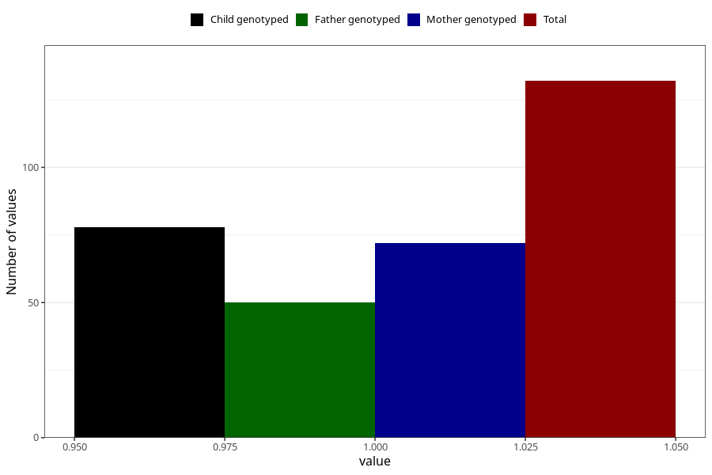

# syndrome_6m
Variable mapping to questionnaire: q4, question DD1110.
- Number of values:

| Value | Total | Child genotyped | Mother genotyped | Father genotyped |
| ----- | ----- | --------------- | ---------------- | ---------------- |
| Missing | 113491 | 75353 | 71697 | 50168 |
| Non-missing | 132 | 78 | 72 | 50 |
| 1 | 132 | 78 | 72 | 50 |

