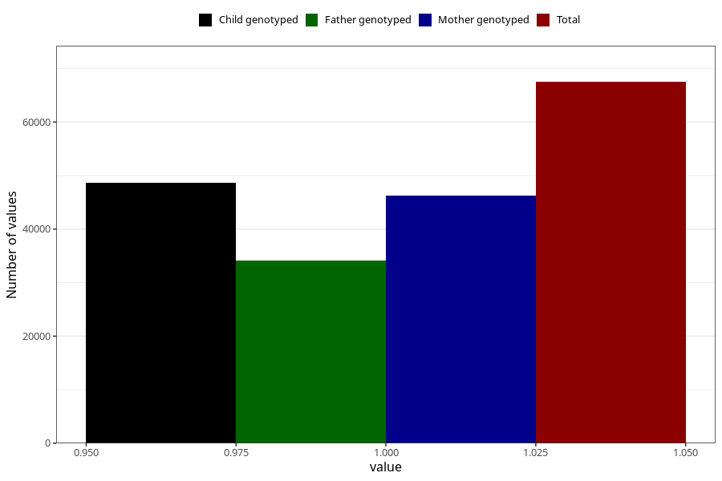

# testicles_not_descended_into_scrotum_no_18m
Variable mapping to questionnaire: q5, question EE819.
- Number of values:

| Value | Total | Child genotyped | Mother genotyped | Father genotyped |
| ----- | ----- | --------------- | ---------------- | ---------------- |
| Missing | 46130 | 26798 | 25577 | 16071 |
| Non-missing | 67493 | 48633 | 46192 | 34147 |
| 1 | 67493 | 48633 | 46192 | 34147 |

