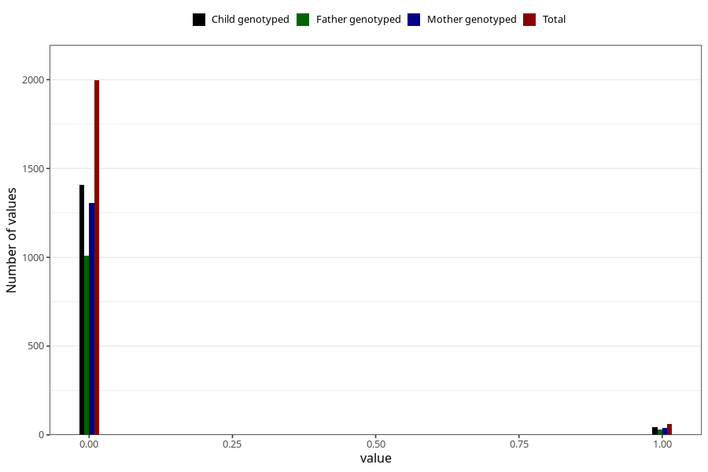

# trouble_relating_to_others_previous_3y
Variable mapping to questionnaire: q6, question GG580.
- Number of values:

| Value | Total | Child genotyped | Mother genotyped | Father genotyped |
| ----- | ----- | --------------- | ---------------- | ---------------- |
| Missing | 111564 | 73978 | 70423 | 49181 |
| Non-missing | 2059 | 1453 | 1346 | 1037 |
| 0 | 1996 | 1408 | 1306 | 1008 |
| 1 | 63 | 45 | 40 | 29 |

