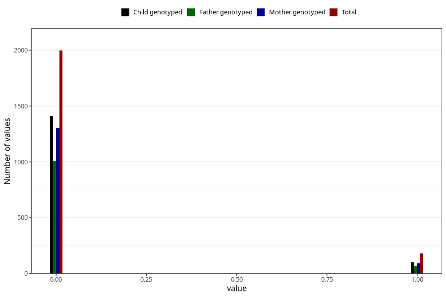

# trouble_relating_to_others_yes_3y
Variable mapping to questionnaire: q6, question GG579.
- Number of values:

| Value | Total | Child genotyped | Mother genotyped | Father genotyped |
| ----- | ----- | --------------- | ---------------- | ---------------- |
| Missing | 111447 | 73921 | 70369 | 49142 |
| Non-missing | 2176 | 1510 | 1400 | 1076 |
| 0 | 1996 | 1409 | 1306 | 1008 |
| 1 | 180 | 101 | 94 | 68 |

