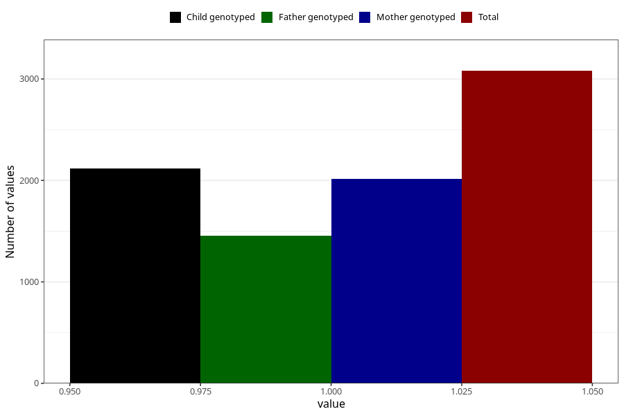

# formula_nan_ha1_3m
Variable mapping to questionnaire: q4, question DD80.
- Number of values:

| Value | Total | Child genotyped | Mother genotyped | Father genotyped |
| ----- | ----- | --------------- | ---------------- | ---------------- |
| Missing | 110543 | 73314 | 69755 | 48764 |
| Non-missing | 3080 | 2117 | 2014 | 1454 |
| 1 | 3080 | 2117 | 2014 | 1454 |

