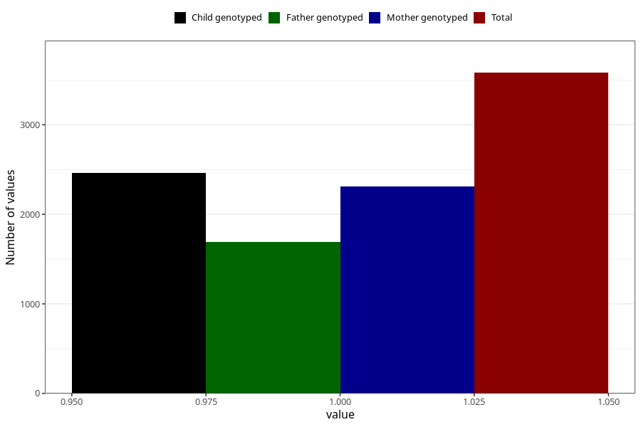

# other_milk_5m
Variable mapping to questionnaire: q4, question DD89.
- Number of values:

| Value | Total | Child genotyped | Mother genotyped | Father genotyped |
| ----- | ----- | --------------- | ---------------- | ---------------- |
| Missing | 110042 | 72967 | 69454 | 48528 |
| Non-missing | 3581 | 2464 | 2315 | 1690 |
| 1 | 3581 | 2464 | 2315 | 1690 |

