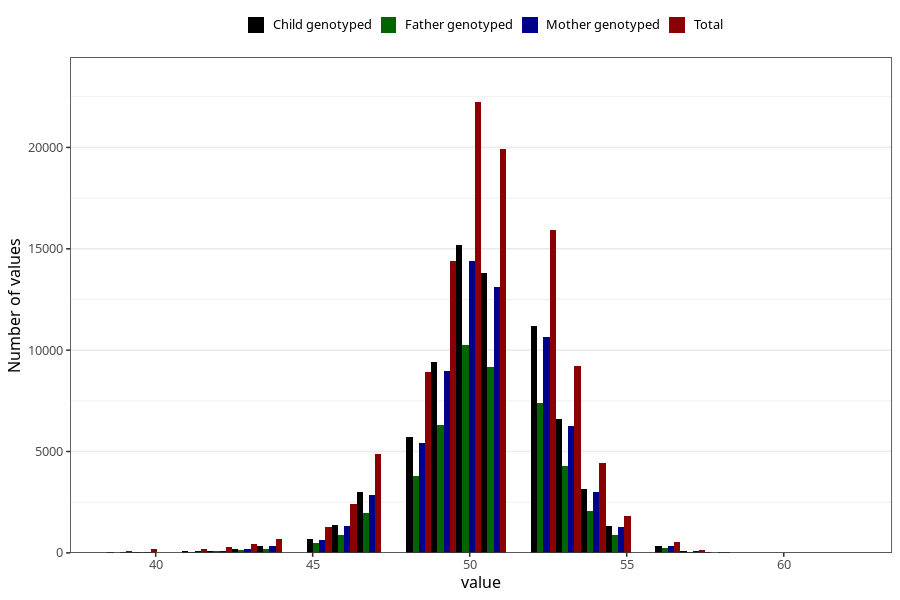

# length_birth
Variable mapping to questionnaire: mfr, question LENGDE.
- Number of values:

| Value | Total | Child genotyped | Mother genotyped | Father genotyped |
| ----- | ----- | --------------- | ---------------- | ---------------- |
| Missing | 5506 | 2666 | 2545 | 1834 |
| Non-missing | 108117 | 72765 | 69224 | 48384 |
| 25th percentile | 49 | 49 | 49 | 49 |
| 50th percentile | 50 | 51 | 51 | 50 |
| 75th percentile | 52 | 52 | 52 | 52 |

